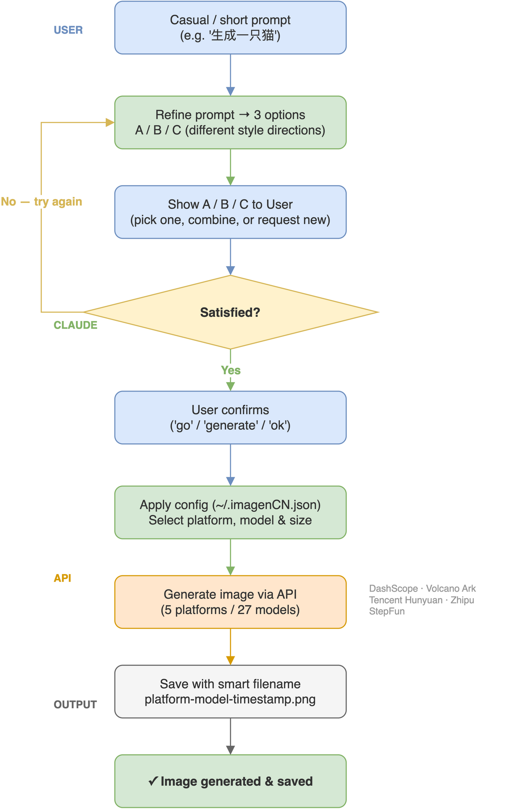

# ImagenCN — AI Image Generation with Chinese Text Excellence

[中文文档](README_CN.md)

A Claude Code / OpenClaw skill for AI image generation using Alibaba Cloud Bailian, ByteDance Volcano Ark, Tencent Hunyuan, Zhipu BigModel, and StepFun APIs.

📋 **[Model Reference](https://agents365-ai.github.io/imagenCN/docs/models.html)** — browse all 30 models with pricing, resolution, and feature comparison.

## Why This Skill?

| Feature | This Skill | Native Claude Code | Other Image Skills |
|---------|-----------|-------------------|-------------------|
| **Chinese text rendering** | ✓ Qwen-Image optimized | ✗ No image generation | Partial |
| **Photorealistic images** | ✓ Wan + Seedream multi-model | ✗ No image generation | Partial |
| **Multi-platform** | ✓ 5 platforms, 28+ models | ✗ N/A | Usually single platform |
| **Multi-model selection** | ✓ 28+ models to choose from | ✗ N/A | Usually single model |
| **Size presets** | ✓ 10+ aspect ratios | ✗ N/A | Partial |
| **Negative prompts** | ✓ Fine-grained control | ✗ N/A | Partial |
| **CLI direct invocation** | ✓ Script ready to use | ✗ N/A | Requires custom code |
| **Multi-region API** | ✓ China / Singapore / US (DashScope) | ✗ N/A | Usually single region |

**Key advantages:**
- **Best Chinese text** — Qwen-Image is one of the best models for rendering Chinese text on images
- **Realism + art** — Wan series + Seedream cover everything from quick drafts to professional 4K output
- **Platform choice** — Pick DashScope for text, Volcano Ark for photo+text combo, Hunyuan for complex composition
- **Ready to use** — `pip install` two packages + one API key to get started

## Pipeline



## Features

- **Alibaba Cloud Bailian (DashScope)**: Qwen-Image 2.0, Edit, Wan Series, Z-Image — 21 models
- **ByteDance Volcano Ark**: Doubao-Seedream series (5.0/4.5/4.0) — 3 models, up to 4K
- **Tencent Hunyuan**: Hunyuan Image 3.0 — flagship, complex Chinese composition
- **Zhipu / BigModel**: CogView-4, GLM-Image — 3 models, native Chinese text in images
- **StepFun / 阶跃星辰**: Step-2X, Step-Image-Edit-2 — 2 models, ultra-cheap volume gen
- **Multiple size presets**: 1:1, 16:9, 9:16, 4:3, 3:4, plus 1K/2K/3K/4K
- **Cross-platform**: Windows, macOS, Linux support
- **Multiple API regions**: China (default), Singapore, Virginia (DashScope)

## Install the Skill

**Claude Code (global):**
```bash
git clone https://github.com/Agents365-ai/imagenCN.git ~/.claude/skills/imagenCN
```

**Claude Code (project-specific):**
```bash
git clone https://github.com/Agents365-ai/imagenCN.git .claude/skills/imagenCN
```

**OpenClaw:**
```bash
git clone https://github.com/Agents365-ai/imagenCN.git skills/imagenCN
```

**SkillsMP:** Search `imagenCN` on [skillsmp.com](https://skillsmp.com) for one-click install.

## Requirements

### System Requirements

- Python 3.8+
- pip

### Install Dependencies

```bash
pip install dashscope requests
```

### API Keys

```bash
# Alibaba Cloud Bailian (DashScope)
export DASHSCOPE_API_KEY="your_api_key"
# Get key: https://bailian.console.aliyun.com/

# ByteDance Volcano Ark (optional)
export ARK_API_KEY="your_api_key"
# Get key: https://console.volcengine.com/ark/region:ark+cn-beijing/apikey

# Tencent Hunyuan (optional)
export HUNYUAN_API_KEY="your_api_key"
# Get key: https://console.cloud.tencent.com/tokenhub/apikey

# Zhipu / BigModel (optional)
export ZHIPUAI_API_KEY="your_api_key"
# Get key: https://bigmodel.cn

# StepFun / 阶跃星辰 (optional)
export STEP_API_KEY="your_api_key"
# Get key: https://platform.stepfun.com/interface-key
```

### Config File (Optional)

Create `~/.imagenCN.json` for personal defaults:

```json
{"platform": "ark", "model": "doubao-seedream-5-0-260128", "size": "2K"}
```

Project-level `.imagenCN.json` overrides user-level. CLI args override both.

### Optional Environment Variables

```bash
# Set default model per platform
export DASHSCOPE_MODEL="wan2.7-image-pro"       # DashScope default
export ARK_MODEL="doubao-seedream-5-0-260128"   # Volcano Ark default
export HUNYUAN_MODEL="hy-image-v3.0"            # Tencent Hunyuan default
export ZHIPUAI_MODEL="cogview-4"                # Zhipu default
export STEP_MODEL="step-2x-large"               # StepFun default

# Set API endpoint (DashScope only, default: cn)
export DASHSCOPE_API_BASE="cn"  # or "sg", "us", or full URL
```

## Quick Start

### Natural Language (Claude Code)

Just tell Claude what you want:

```
Generate an image of a cute orange cat
Create a poster with text "Happy New Year" in Chinese
Make a photorealistic 4K mountain sunset photo using wan2.7-image-pro
Generate a 16:9 landscape wallpaper
```

### Command Line

```bash
# Basic usage (default model: qwen-image-2.0-pro, native 2K)
python scripts/generate_image.py "A cute cat" output.png

# Photorealistic 4K with Wan2.7 (DashScope)
python scripts/generate_image.py --model wan2.7-image-pro --size 4K "Mountain sunset" photo.png

# Volcano Ark (ByteDance) — requires ARK_API_KEY
python scripts/generate_image.py --platform ark "Editorial portrait, Vogue style" portrait.png

# Tencent Hunyuan — requires HUNYUAN_API_KEY
python scripts/generate_image.py --platform hunyuan "Astronaut on the moon, cinematic" scifi.png

# Edit an existing image (DashScope, requires --image)
python scripts/generate_image.py --model qwen-image-edit-max --image input.png "Change the background to a beach" edited.png

# With negative prompt (DashScope)
python scripts/generate_image.py --negative "blurry" "High quality portrait" portrait.png

# List all 5 platforms' models
python scripts/generate_image.py --list-models
```

## Models

| Model | Best For |
|-------|----------|
| `qwen-image-2.0-pro` | **Default**, latest flagship, native 2K, strongest typography and detail |
| `qwen-image-2.0-pro-2026-06-22` | Latest snapshot (Jun 2026), generation + editing fusion |
| `qwen-image-2.0` | Standard 2.0 tier, native 2K |
| `qwen-image-max` | Previous-gen flagship |
| `qwen-image-max-2025-12-30` | qwen-image-max snapshot, improved realism |
| `qwen-image-plus` | Distilled accelerated version |
| `qwen-image-plus-2026-01-09` | qwen-image-plus snapshot (Jan 2026) |
| `qwen-image-edit-max` | Flagship image editing (requires `--image`) |
| `qwen-image-edit-max-2026-01-16` | Latest editing snapshot (Jan 2026) |
| `qwen-image-edit-plus` | Fast, lower-cost image editing |
| `qwen-image` | Base model |
| `wan2.7-image-pro` | Latest photorealistic, up to 4K output |
| `wan2.7-image` | Wan 2.7 standard, up to 2K |
| `wan2.6-t2i` | Wan 2.6, flexible sizing |
| `wan2.5-t2i-preview` | High quality art |
| `wan2.2-t2i-flash` | Fast generation |
| `wan2.2-t2i-plus` | Professional tier |
| `wanx2.1-t2i-turbo` | Fast execution |
| `wanx2.1-t2i-plus` | Professional tier |
| `wanx2.0-t2i-turbo` | Earlier generation |
| `z-image-turbo` | Lightweight, fast & low-cost; portraits and product images |
| `doubao-seedream-5-0-260128` | ByteDance latest, up to 3K, PNG/JPEG, best text rendering |
| `doubao-seedream-4-5-251128` | ByteDance Seedream 4.5, up to 4K |
| `doubao-seedream-4-0-250828` | ByteDance Seedream 4.0, budget-friendly 4K |
| `hy-image-v3.0` | Tencent Hunyuan flagship, strong Chinese composition understanding |
| `cogview-4` | Zhipu CogView-4, native Chinese text in images |
| `cogview-4-250304` | CogView-4 fixed snapshot (Mar 2025), reproducible results |
| `glm-image` | Zhipu GLM-Image flagship, up to 2048×2048 |
| `step-2x-large` | StepFun high quality, 0.1 RMB/image |
| `step-image-edit-2` | StepFun ultra-cheap, 0.02 RMB/image, negative prompt support |

## Size Presets

**Qwen-Image 2.0 (native 2K):**
- `1:1` → 2048×2048 (default)
- `16:9` → 2688×1536
- `9:16` → 1536×2688
- `4:3` → 2304×1728
- `3:4` → 1728×2304
- `1K` → 1024×1024
- `2K` → 2048×2048

**Qwen-Image legacy:**
- `1:1` → 1328×1328
- `16:9` → 1664×928
- `9:16` → 928×1664
- `4:3` → 1472×1104
- `3:4` → 1104×1472

**Z-Image (pixel area 512×512 to 2048×2048):**
- `1:1` → 1024×1024 (default)
- `16:9` → 1280×720
- `9:16` → 720×1280
- `2:3` → 1024×1536
- `3:2` → 1536×1024

**Wan Series (Wan2.7 also accepts `1K`/`2K`/`4K`):**
- `1:1` → 1024×1024
- `1:1-large` → 1280×1280
- `16:9` → 1280×720
- `9:16` → 720×1280
- `4:3` → 1200×900
- `3:4` → 900×1200
- `2:1` → 1440×720

**Volcano Ark (Seedream):**
- `1:1` → 2048×2048
- `16:9` → 2848×1600
- `9:16` → 1600×2848
- `4:3` → 2304×1728
- `3:4` → 1728×2304
- `1K` / `2K` / `3K` / `4K` (model-dependent)

**Tencent Hunyuan (colon-separated):**
- `1:1` → 1024:1024
- `16:9` → 1920:1080
- `9:16` → 1080:1920
- `4:3` → 1600:1200
- `3:4` → 1200:1600
- `3:2` → 1920:1280
- `2:3` → 1280:1920

**Zhipu (CogView-4 / GLM-Image):**
- `1:1` → 1024x1024 (default)
- `16:9` → 1344x768
- `9:16` → 768x1344
- `4:3` → 1152x864
- `3:4` → 864x1152
- `2:1` → 1440x720
- `1:2` → 720x1440

**StepFun (Step-2X):**
- `1:1` → 1024x1024 (default)
- `1:1-small` → 512x512
- `16:9` → 1280x800
- `9:16` → 800x1280

## API Endpoints

| Region | Alias | URL |
|--------|-------|-----|
| **China** (default) | `cn` | `https://dashscope.aliyuncs.com/api/v1` |
| Singapore | `sg` | `https://dashscope-intl.aliyuncs.com/api/v1` |
| Virginia | `us` | `https://dashscope-us.aliyuncs.com/api/v1` |

## Support

If this project helps you, consider supporting the author:

<table>
  <tr>
    <td align="center">
      
      <br>
      <b>WeChat Pay</b>
    </td>
    <td align="center">
      
      <br>
      <b>Alipay</b>
    </td>
    <td align="center">
      
      <br>
      <b>Buy Me a Coffee</b>
    </td>
    <td align="center">
      
      <br>
      <b>Give a Reward</b>
    </td>
  </tr>
</table>

## Author

**Agents365-ai**

- Bilibili: https://space.bilibili.com/441831884
- GitHub: https://github.com/Agents365-ai

## License

[CC BY-NC 4.0](LICENSE) — free for non-commercial use. Commercial use requires permission.
